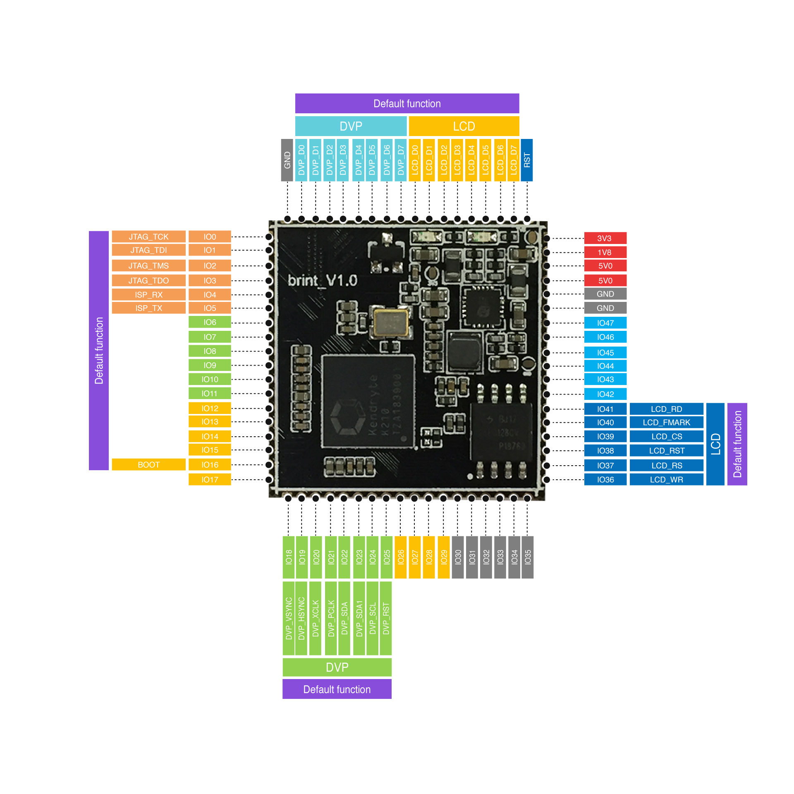

# Fe845核心板

* **核心板说明**
  * Fe845核心板功能引脚定义图

    
* **核心板资源**
  * AI主芯片
  * 芯片内置8M的SRAM
  * 核心板内置16M的FLASH
  * 核心板内置电源管理芯片、26MHz无源晶振
* **核心板资料**
  * [Fe845购买链接](https://item.taobao.com/item.htm?spm=a2oq0.12575281.0.0.a7a21debWBBg08&ft=t&id=596369001614)
  * [Fe845核心板硬件资料下载](http://www.ai-alloy.com/download.html)

