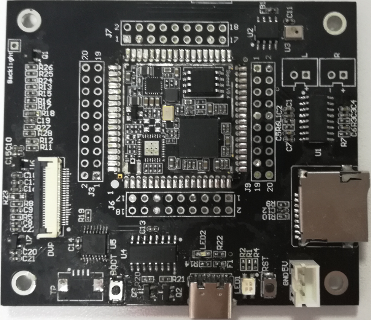

# Alloy-eyes开发板

* **开发板**

  

* **资源**
  * 核心板T210
  * 双面摄像头（gc0308红外+可见光）
  * 单目摄像头（gc0308可见光）
  * 带触摸的LCM模组
  * TF卡座
  * Type-C接口
  * TP接口（可选）
  * 供电2P座子
  * DAC（SPEAKER）接口
  * MIC
* **相关资料**
  * 底板pdf的原理图
  * 底板的贴片图
  * [ ] [Alloy-Eye开发板硬件资料下载](http://res.ai-alloy.com/AlloyEyes/HDK.rar)

