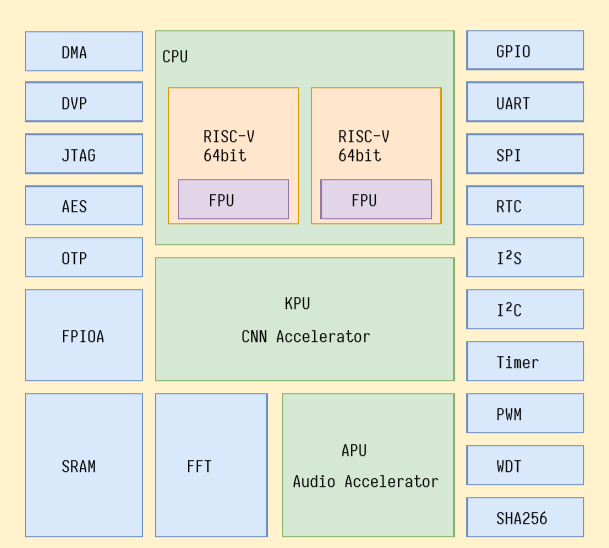

# AI主芯片

AI主芯片定位于人工智能与边缘计算两个领域，主要用于AioT市场，是一颗集成机器视觉与听觉的系统级芯片（SOC）。透过深度神经网络处理器灵活运用图像识别、语音识别、视频处理、信息检索等功能，提升产品在IoT应用场景中的功能优势，扩大神经网络在物联网的使用范围。

* **应用领域**
  
  * 用于传感器边缘计算和数据抽象
  * 工业、商用物联网领域的传感器数据前处理节点
  * 基于机器视觉的通用舞台跟踪
  * 基于机器视觉的一般物体识别
  * 人脸检测和人脸识别
  * 基于麦克风阵列的声源定向
  * 基于麦克风阵列的声场成像
  * 远场语音唤醒
  * 语音识别
  * 智能家居、家电、厨电
  * 智能儿童玩具、故事机
* **AI解决方案**
  * 基于卷积神经网络的一般目标检测
  * 基于卷积神经网络的图像分类任务
  * 人脸检测和人脸识别
  * 实时获取被检测目标的大小与坐标
  * 实时获取被检测目标的种类、数量和颜色
* **芯片参数**
  * 性能
    1. 中央处理器：RISC-V Dual-Core 64bit@400MHz,双精度FPU  
    2. 图像识别：QVGA@60fps/VGA@30fps  
    3. 语音识别：麦克风阵列（8mics\)  
  * 扩展性
    1. 操作系统：FreeRTOS/SylixOS/RTThread/Zephyr等
    2. 网络模型：tinyyolov2/mobilenetv1
    3. 深度学习框架：TensorFlow/TensorFlow Lite/Keras/Darknet
    4. 外 设：FPIOA、UART、GPIO、SPI、I2C、I2S、WDT、TIMER、RTC ...
  * 功耗
    1. 典型应用场景功耗&lt;1W
    2. 芯片功耗&lt;400mW
* **芯片架构图**

  

* [Kentdry官网资料下载](https://kendryte.com/downloads/)

