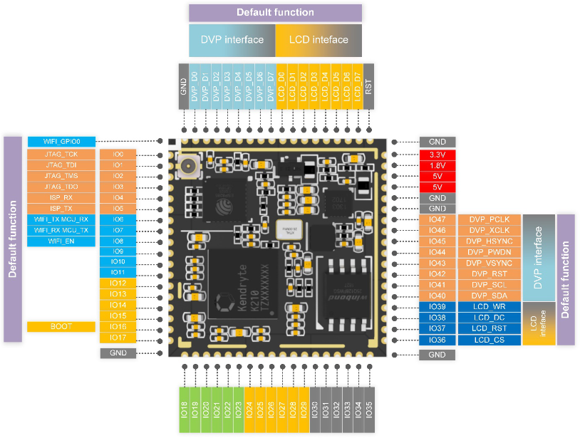

# T210核心板

* **核心板说明**
  * T210核心板功能引脚定义图

    
* **核心板资源**
  * K210 AI芯片
  * 芯片内置8M的SRAM
  * 核心板内置16M的FLASH
  * 核心板内置电源管理芯片、26MHz无源晶振
* **核心板资料**
  * [ ] [T210核心板硬件资料下载](http://res.ai-alloy.com/AlloyEyes/HDK.zip)

