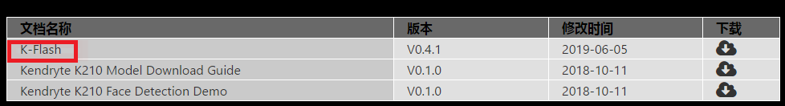

# 开发环境搭建

## 一、linux环境

#### 1、linux环境搭建

可在windows上安装workstation虚拟机，然后在虚拟机上安装ubuntu系统（建议使用16.04）

关于虚拟机上安装ubuntu系统可以自行百度，资料还是比较详细的。

#### 2、安装依赖库

在linux下，需要下载linux版本固件烧录脚本Kflash.py，可在github下载：

git clone [https://github.com/kendryte/kflash.py.git](https://github.com/kendryte/kflash.py.git)

Kflash.py是基于python3编写的，需要安装python3相关库，如下：

sudo apt update

sudo apt install python3 python3-pip

sudo pip3 install pyserial

#### 3、获取SDK代码

github会有提供相关样例，包括src目录和build目录，但不是完整的SDK，build目录的是已经根据src对应目录编译的最终文件，直接下载对应的bin文件到开发板可直接跑。

* [SDK github 下载（非完整）](https://github.com/ai-alloy/alloy-eyes-sdk)
* 完整的SDK代码可联系FAE获取

#### 4、获取编译工具链

编译工具链需通过以下方式获取。

* 编译工具链获取可联系FEA获取

编译器工具可解压到/opt/my-kendryte-toolchain这个默认路径，编译脚本使用的是这个默认路径，也可自行修改。

#### 5、下载Kflash烧录工具

下载windows版本下载工具K-Flash，可方便在windows环境下载固件到开发板（当然也可直接在linux环境下使用命令烧录），如下图

* 下载地址：[https://kendryte.com/downloads/](https://kendryte.com/downloads/)

  

#### 6、Tpye-C连接线

主要用于供电，烧录以及调试。

## 二、windows（IDE）环境

#### 1、下载IDE工具

​		[Windows IDE 下载链接](http://kendryte-ide.s3-website.cn-northwest-1.amazonaws.com.cn/)，如图

​		

#### 2、IDE如何安装和使用

​	   1、IDE是在开源vscode基础的集成的，使用可参考vscode，其中IDE里已经内嵌了cmake和编译工具。

​		2、安装完成后，点击KendryteIDE\Application\app_1.34.1-beta_20190802.2下的KendryteIDE.exe打			  开IDE。

#### 3、SDK的下载同上述说明。

