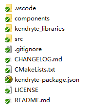

# 代码结构

#### 一、SDK的代码目录：

说明：

components：支持外挂组件；

kendryte_libraries:官方sdk；

src:项目代码存放处；

CMakeList.txt:Cmake编译文件；

kendryte-package.json:使用IDE的配置文件

使用IDE编译后会在跟目录生成build文件，包含中间件和最终生成的下载到设备的bin文件

#### 二、components代码目录：

说明：

facesdk:人脸识别模组支持库

fat-fs-module:文件系统支持库组件

jsoncpp-sdk：json解析库组件

littlevgl-gui-module：轻量级图形界面GUI的组件

mqtt-sdk：mqtt组件

rapidjson-sdk：json解析库组件（功能同于jsoncpp-sdk，可选用其一）

