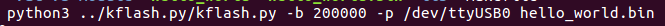
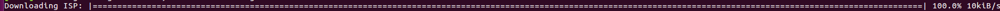
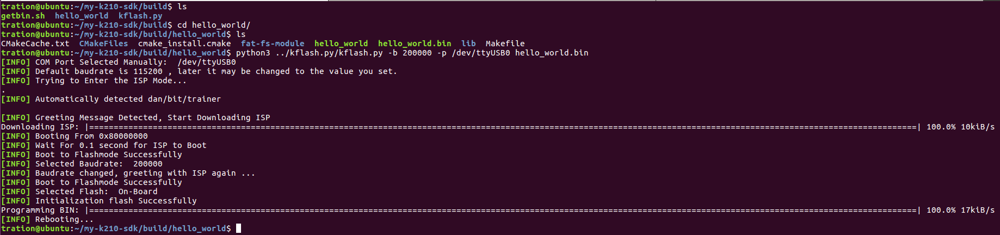

# 下载固件到开发板

支持linux和windows下下载固件到开发板。

## linux环境下：

1、用Type-C连接开发板和电脑；

2、按开发板上的住boot按键；

3、执行以下固件下载命令：

python3 kflash.py -b 200000 -p ttyUSB0 firmware.bin

说明：kflash.py 下载脚本

-b 波特率设置

-p 选择串口

firmware.bin 要烧录的固件

例如：

执行下载命令：

当出现如下图时放开boot按键，进入下载模式

整个过程如下图所示：

## windows环境下：

1、用Type-C连接开发板和电脑

2、打开k-flash.exe下载工具，选择对应串口，导入固件

3、先按住开发板的boot按键，点击烧录工具Flash按键,出现如下图红框出现的进度和进度条时可松开boot按键

4、 等待烧录完成。

5、按复位键重新上电，可连接串口调试。

