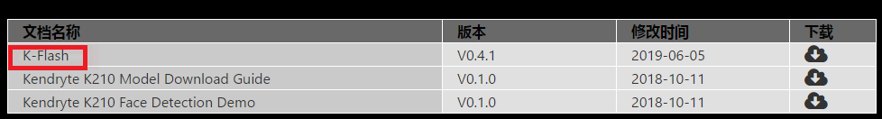

# 开发环境搭建

#### 1、下载IDE工具

​		[Windows IDE 下载链接](http://kendryte-ide.s3-website.cn-northwest-1.amazonaws.com.cn/)，如图

​		

#### 2、IDE如何安装和使用

​	   1、IDE是在开源vscode基础的集成的，使用可参考vscode，其中IDE里已经内嵌了cmake和编译工具。

​		2、安装完成后，点击KendryteIDE\Application\app_1.34.1-beta_20190802.2下的KendryteIDE.exe打			  开IDE。

#### 3、获取SDK代码

github会有提供相关样例，包括src目录和build目录，但不是完整的SDK，build目录的是已经根据src对应目录编译的最终文件，直接下载对应的bin文件到开发板可直接跑。

* [SDK github 下载（非完整）](https://github.com/ai-alloy/alloy-eyes-sdk)
* 完整的SDK代码可联系FAE获取

#### 4、下载Kflash烧录工具

下载windows版本下载工具K-Flash，可方便在windows环境下载固件到开发板（当然也可直接在linux环境下使用命令烧录），如下图

* 下载地址：[https://kendryte.com/downloads/](https://kendryte.com/downloads/)

  

#### 5、Tpye-C连接线

​	用于供电，烧录以及调试。