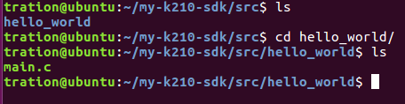

# 开始第一份代码

在src目录下新建项目文件夹，比如新建hello\_world，在此文件下放置源代码

cd src && mkdir hello\_world



添加源代码入口文件是main.c，入口函数为main\(\)

```text
int core1_function(void *ctx)
{
    uint64_t core = current_coreid();
    printf("Core %ld Hello world\n", core);
    while(1);
}

int main()
{
    uint64_t core = current_coreid();
    printf("Core %ld Hello world\n", core);
    register_core1(core1_function, NULL);
    while(1);
}
```

