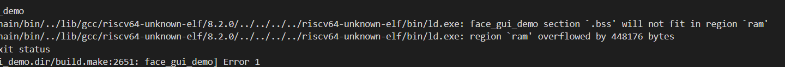

# 常见问题

### 一、开发资料获取

​			1、登录公司[官网](https://www.ai-alloy.com/)中[wiki](https://wiki.ai-alloy.com/)页获取开发资料、

​			2、[下载](https://www.ai-alloy.com/download.html)页获取HDK和SDK.

### 二、获取SDK

​			官网下载的SDK是非完整版本（未带人脸识别算法），完整版本请联系公司业务或FAE获取。			

### 三、如何搭建开发环境

​		   参考wiki中[开发环境搭建](https://wiki.ai-alloy.com/ready-intro/env-build)。

### 四、SDK是否带人脸识别算法

​		 SDK中带人脸识别算法，以库的形式提供，并提供相应的接口。

### 五、添加应用后编译报错

​		 下图是用windows系统的IDE编译后报错的截图：

​		    

1、K210RAM大小为8M，其中2M专门AI用，剩余6M留给应用。系统启动时FLASH的固件要加载到RAM执行，会                占用RAM的空间，还要考虑预留上固件运行时的静态和动态分配所需的大小，因此固件的大小是有限制的，建议 固件大小尽量不要超过4M

2、在编写固件时，考虑固件大小，如果出现如图所以的错误提示，可能是固件所在内存溢出了。

### 六、人脸识别算法性能指标

- 配置：K210 
- 双核摄像头：30万
- 逆光识别照度：< 6000Lux
- 有效识别距离：0.3⽶ ~1.2⽶
- 补光：红外补光（LED）
- 算法类型：深度学习⼈脸识别算法
- ⼈脸库：1 : N(2000⼈脸库)
- 识别时间：110毫秒
- 识别率：> 99.6%
- 误识率：< 0.01%
- 活体检测：⽀持

### 七、从服务端导入照片做识别模板

 1、提供服务端图片转识别模板的接口，参考facedll.rar，其中IntPtr faceDetectAndConvert(string path)接是		  将png或jpg格式的图片转成设备端需要的模板格式；

 2、 实现此功能需要客户结合自己的服务端来实现，仅提供链接库和API接口及使用说明；

 3、设备端的应用实现：

- 将服务端转换的数据送到设备端的FACE_API int facedetect(image input, int** pcoor)接口座检测，检 测通过后通过提取特征值作为第一次识别的模板；

- 第一次识别时可以比分阈值稍微降低点（参考实际测试的阈值），识别通过后，再将设备端采集的用来做识别的模板替换网络下发的模板；

-  恢复之后做识别的比分阈值；

​	设备端的具体实现跨越参考SDK里的src/face_gui_demo。

### 八、是否支持语音播放

​			支持，可在开发板接入外置speak，运行/src/play_pcm DEMO,如何外接喇叭可参考开发板的外设连接图。

### 九、是否有核心板的AD封装格式

​			有，请到HDK/footprint处获取。